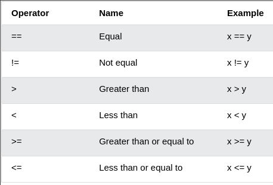

# Booleanos

Los datos del tipo booleano solo pueden tomar dos valores `True` y `False`. Este tipo de dato será muy importante cuando se usen los *operadores* de comparasión. Las primeras letras, T y F, siempre son mayúsculas.

```python
print(True)
print(False)
```

# Operadores

Python soporta varios tipos de operadores. En esta sección nos enfocaremos en algunos de ellos. En esta sección, las imagenes fueron extraídas de [W3Schools](https://www.w3schools.com/python/python_operators.asp).

## Operadores aritméticos

Los operadores aritméticos son los encargados para realizar las operaciones matemáticas.


## Operadores de asignación

Los operadores de asignación son usados para asignar valores a las variables.


Realicemos algunos ejemplos

```python
print('Suma', 1 + 2)
print('Resta', 2 - 1)
print('Multiplicacion', 2 * 3)
print('Division', 4 / 2)
print('Division', 6 / 2)
print('Division', 7 / 2)
print('Division entera', 7 // 2)
print('Division entera', 7 // 3)
print('Modulo', 3 % 2)
print('Potencias', 2 ** 3)
```

Declaremos algunas variables asignandoles un valor numérico:

```python
a = 7
b = 3

suma = a + b
resta = a - b
multi = a * b
division = a / b
res = a % b
floor = a // b
exponente = a ** b

print(suma)
print('a + b = ', suma)
print('a - b = ', resta)
print('a * b = ', multi)
print('a / b = ', division)
print('a % b = ', res)
print('a // b = ', floor)
print('a ** b = ', exponente)
```

Hagamos un programa en un editor de texto
```python
print('== Operaciones Suma, resta, multiplicacion, division, modulo ==')

# Declaracion de variables
num1 = 3
num2 = 4

# Operaciones Aritmeticas
suma = num1 + num2
resta = num1 - num2
multi = num1 * num2
div = num2 / num1
mod = num2 % num1

#Imprimimos los resultados
print('Suma: ', suma)
print('Resta: ', resta)
print('Multiplicacion: ', multi)
print('Division: ', div)
print('Modulo: ', mod)
```

Hagamos un programa mas real:

```python
# Area de un circulo
radio = 10                     # Radio del circulo
area_circ = 3.14 * radio ** 2  # Area del circulo
print('Area del circulo: ', area_circ)

# Calculando el area de un rectangulo
ancho = 30
largo = 12
area_rect = ancho * largo
print('Area del rectangulo: ', area_rect)

# Calculo del peso de un objeto
masa = 40 # kg
g = 9.81 # m/s^2
peso = masa * g
print('Peso= ', peso, ' N')

# Calculando la densidad de un líquido
masa = 25 # kg
vol = 0.075 # en m^3
dens = masa / vol
```


## Operadores de comparasión

Los operadores de comparasión son usados para comparar dos valores. En los programas es usual que hagamos comparaciones de números.



Ejemplos:

```python
print(3 > 2)    
print(3 >= 2)   
print(3 < 2)     
print(2 < 3)     
print(2 <= 3)    
print(3 == 2)    
print(3 != 2)    
print(len('mango') == len('ciruela'))  # False
print(len('mango') != len('ciruela'))  # True
print(len('mango') < len('ciruela'))   # True
print(len('leche') != len('carne'))      # False
print(len('leche') == len('carne'))      # True
print(len('atun') == len('tuna'))  # True
print(len('python') > len('dragon'))   # False


print('True == True: ', True == True)
print('True == False: ', True == False)
print('False == False:', False == False)
```

En python tenemos los siguientes operadores extra:
- `is` Dará verdadero si ambos datos/variables son los mismos objetos
- `is not` Dará verdadero si no son los mismos objetos
- `in` Dará verdadero si la lista o string contiene cierto item
- `not in` Dará verdadero si la lista o string no tiene cierto item

Ejemplos:

```python
print('1 is 1', 1 is 1)                   # True
print('1 is not 2', 1 is not 2)           # True
print('a in Carlos', 'a' in 'Carlos') # True
print('c in Carlos', 'c' in 'Carlos') # False
print('codigo' in 'codigo en masa') # True
print('a in caballo:', 'a' in 'caballo')      # True
print('4 is 2 ** 2:', 4 is 2 ** 2)   # True
```
